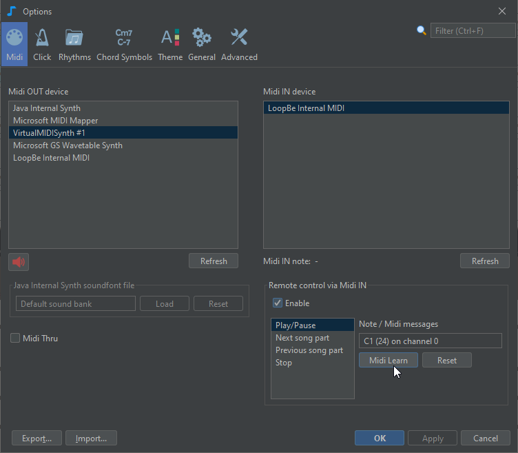

# Midi remote commands

Some playback control commands can be triggered by incoming Midi messages.

For example you can start/pause the playback or skip to the next song part just by pressing a note on your piano keyboard.

First select your Midi IN device. If the list empty, then no Midi IN device is available on your system.

By defaultUse the Midi Learn button to change
