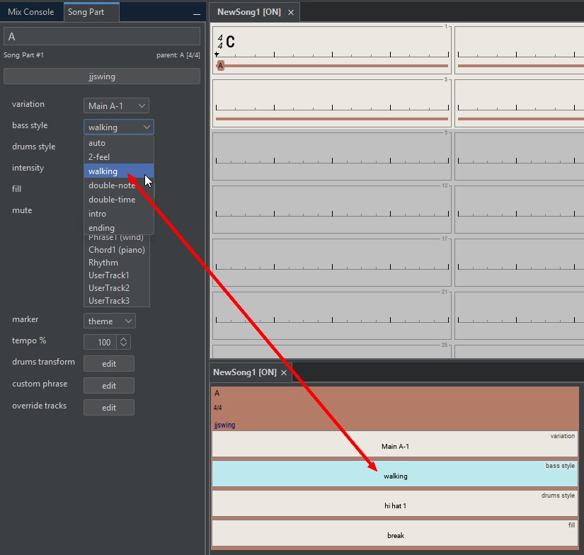
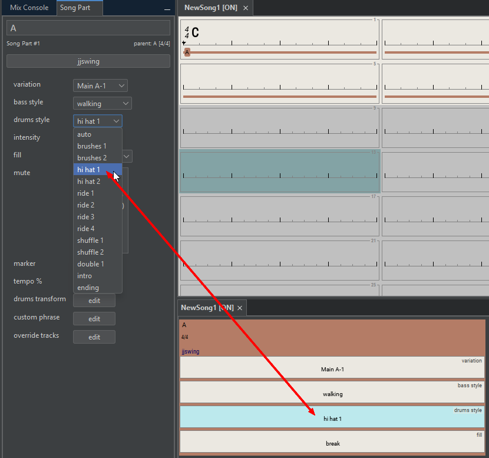
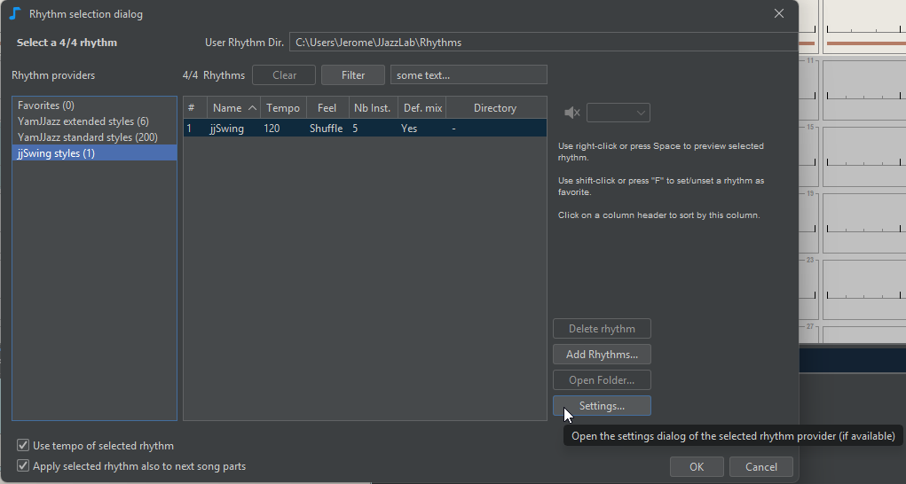
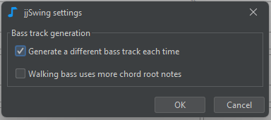

# jjSwing rhythm engine

**jjSwing**'s unique features are:

* A **realistic walking bass with melodic lines**, which automatically adjust to the tempo
* 11 drums variations (brushes, hi-hat, ride, shuffle)
* Double-time capability (play twice as fast with chord changes at original tempo)
* The possibility to adjust bass and drums independently


jjSwing is optimized to work with the internal [FluidSynth ](../sounds/using-fluidsynth.md)as output synth. If you use a different output synth, you might hear weird sounds.


Note that current jjSwing version only supports 4/4 time signature. Jazz waltz support will be added later.



## Rhythm parameters

jjSwing has 2 specific rhythm parameters, bass style and drums style.

### Bass style

Possible values are shown in the image below.

<figure><figcaption></figcaption></figure>

<table><thead><tr><th width="135">Bass style</th><th>Description</th></tr></thead><tbody><tr><td>auto</td><td>Actual bass style will depend on the rhythm variation (e.g. Main A-1)</td></tr><tr><td>2-feel</td><td>Walking in two</td></tr><tr><td>walking</td><td>Walking bass</td></tr><tr><td>double-note</td><td>Walking bass with many double notes (repeated notes)</td></tr><tr><td>double-time</td><td>Walking bass played twice as fast while preserving chord changes at original tempo. This should be used when Drums style is also set to double-time.</td></tr><tr><td>intro</td><td>To be used with rhythm variation Intro A</td></tr><tr><td>ending</td><td>To be used with rhythm variation Ending A</td></tr><tr><td></td><td></td></tr></tbody></table>

### Drums style

Possible values are shown in the image below.

<figure><figcaption></figcaption></figure>

<table><thead><tr><th width="135">Drums style</th><th>Description</th></tr></thead><tbody><tr><td>auto</td><td>Actual drums style will depend on the rhythm variation (e.g. Main A-1)</td></tr><tr><td>brushes 1/2</td><td>2 different brushes-based drums</td></tr><tr><td>hi-hat 1/2</td><td>2 different hi hat-based drums</td></tr><tr><td>ride 1/2/3/4</td><td>4 different ride-based drums</td></tr><tr><td>shuffle 1/2</td><td>2 different 12/8-based drums</td></tr><tr><td>double</td><td>Drums played twice as fast while preserving chord changes at original tempo. This should be used when Bass style is also set to double-time.</td></tr><tr><td>intro</td><td>To be used with rhythm variation Intro A</td></tr><tr><td>ending</td><td>To be used with rhythm variation Ending A</td></tr></tbody></table>

## Settings

jjSwing settings are available in the Options/Rhythms tab or in the Rhythm selection dialog, when you select the **jjSwing styles** rhythm provider, as shown below.

<figure><figcaption></figcaption></figure>

<figure><figcaption></figcaption></figure>
