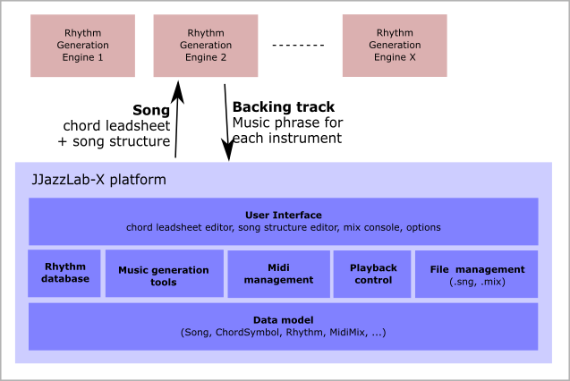
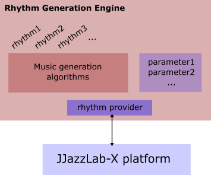

# Rhythm engines overview

The **rhythms** are made available by **rhythm engines**.

Thanks to its open-source and pluggable architecture, JJazzLab can host many different rhythm engines. If you’re a developer you can build your own quite easily!

A rhythm engine has one or more **rhythm providers** which propose a list of supported rhythms and the supported **rhythm parameters**. You can see the list of all available **rhythm providers** in the **rhythm selection dialog**.

JJazzLab currently includes one rhythm engine, [YamJJazz](yamjjazz-rhythm-engine/), which is based on Yamaha styles. Its **rhythm parameters** are Variation, Intensity and Fill (other parameters such as Mute or Tempo Factor are generic and work with any rhythm).

## Future rhythm engines 

Here some examples of what could be developed using the JJazzLab-X infrastructure.

* An AI-based jazz oriented engine with only one versatile rhythm which adapts to different contexts, like a real band (slow or fast tempo, walking bass or not, etc.).
* A drum engine similar to the Logic Pro X virtual drummer
* An engine able to adapt the backing track to a given melody
* A “meta-engine” which lets you combine individual tracks from various rhythms (e.g. combine a hip-hop bass line with latin drums)
* An engine able to read style files from Band-In-A-Box or other arranger keyboards such as Korg or Ketron
* etc.
