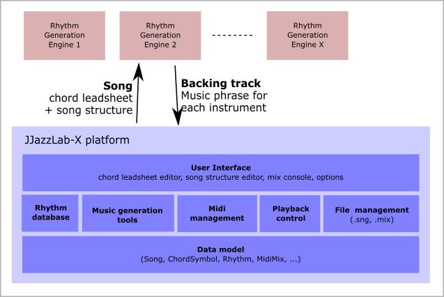

# リズムエンジンの概要

**リズム**は**リズムエンジン**によって生成されます。

オープンソースかつプラグイン可能なアーキテクチャのおかげで、JJazzLabは様々なリズムエンジンをホストできます。開発者であれば、独自のエンジンを簡単に構築できます！

リズムエンジンは、サポートするリズムのリストとサポートする**リズムパラメータ**を提案する1つ以上の**リズムプロバイダ**を備えています。利用可能なすべての**リズムプロバイダ**のリストは、**リズム選択ダイアログ**で確認できます。

JJazzLabには現在、ヤマハスタイルを基にしたリズムエンジン[YamJJazz](yamjjazz-rhythm-engine/)が1つ含まれています。その**リズムパラメータ**はバリエーション、強度、フィルインです（ミュートやテンポなどの他のパラメータは汎用であり、どのリズムでも機能します）。

## これからのリズムエンジン 

以下に、JJazzLab-Xインフラストラクチャを用いて開発可能なものの例を示します。

* AIベースのジャズ指向エンジンで、たった1つの汎用リズムだけで様々な状況に適応。まるで本物のバンドのように（遅いテンポや速いテンポ、ウォーキングベースの有無など）。
* Logic Pro Xのバーチャルドラマーに似たドラムエンジン
* 与えられたメロディに合わせて伴奏トラックを適応させることができるエンジン
* 様々なリズムの個別トラックを組み合わせられる「メタエンジン」（例：ヒップホップのベースラインとラテンドラムを組み合わせる）
* Band-In-A-BoxやKorg、Ketronなどのアレンジャーキーボードからスタイルファイルを読み込めるエンジン
* など
