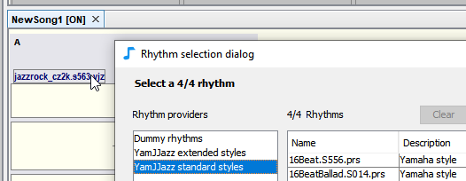

# YamJJazzリズムエンジン

JJazzLab はリズム生成エンジン**YamJJazz** を内蔵しています。このエンジンは[ヤマハスタイル](yamaha-styles.md)を読み込みをおこない、また既存のヤマハスタイルファイルにバリエーションを追加する新しい[拡張ヤマハスタイル](extended-yamaha-styles.md)フォーマットを導入しています。

下のリズム選択ダイアログでは、使用可能な２つのYamJJazz**リズムプロバイダ**が表示されています。

