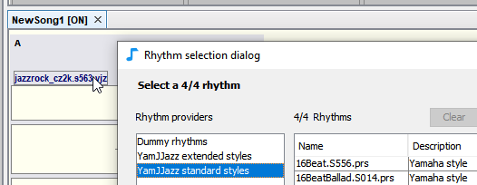

# YamJJazzリズムエンジン

JJazzLab embeds the **YamJJazz** rhythm generation engine. This engine reads [Yamaha styles](yamaha-styles.md) and introduces a new [extended Yamaha style](extended-yamaha-styles.md) format which adds more variations to existing Yamaha style files.

You can see below the 2 YamJJazz **rhythm providers** available in the rhythm selection dialog.

