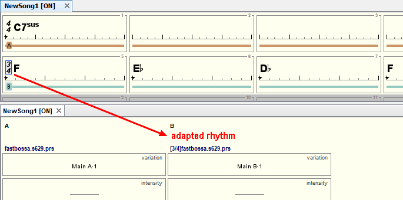

# Adapted rhythms

If you create a **section **with a different time signature, JJazzLab will create the corresponding **song part **with an **adapted rhythm**. This is simply the **rhythm **from the previous song part **adapted **to a new time signature.

You’ll notice that the **adapted rhythm** does not need additional channels in the mix console: it uses the Midi channels of its source rhythm (**fastbossa.s629.prs** in the example above).

If you don’t want the **adapted rhythm**, juste replace it using the **rhythm selection dialog**.


You can't remove a **source rhythm** if its **adapted rhythm** is still present in the song. See example below.


_Example: _any operation (change rhythm, remove song part, change time signature of the parent section) which makes the source rhythm **fastbossa.s629.prs** disappear from the song will generate an error.

In the above case, if you want to replace **fastbossa.s629.prs **by another rhythm, you need first to remove the second song part which uses the **adapted rhythm**.
