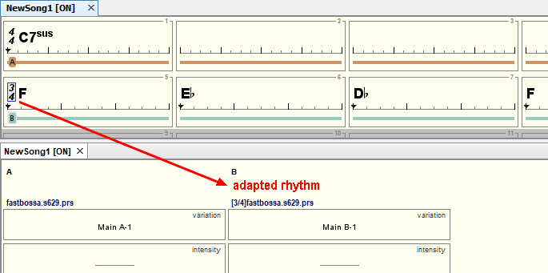

# Adapted rhythms

When you insert a new [section ](../editors/chord-lead-sheet.md#sections)with a new time signature, JJazzLab needs to select a rhythm for the new [song part](../editors/song-structure.md#song-parts).&#x20;

If the new time signature was never used before in the song, JJazzLab will try to create an **adapted rhythm** from the current rhythm (if current rhythm supports this feature). This is simply the current rhythm but shortened or repeated to fit the new measure size.

You’ll notice that the **adapted rhythm** does not need additional channels in the mix console: it uses the Midi channels of its source rhythm (**fastbossa.s629.prs** in the example above).

Use the [rhythm selection dialog](../editors/song-structure.md#change-rhythm) to replace an adapted rhythm by a standard rhythm (or vice-versa).


If time signature was previously used in the song, JJazzLab will simply select the last rhythm used for that time signature.&#x20;


