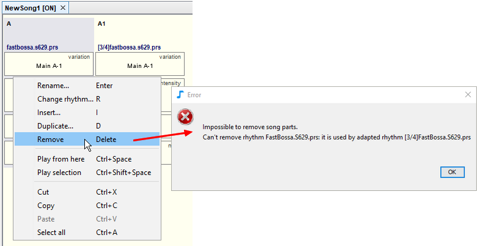

# リズムの適応

異なる拍子の**セクション**を作成した場合、JJazzLabは**適応するリズム**の**ソングパート**を作成します。これは、単純に前のソングパートの**リズム**を新しい拍子に**適応**させたものです。

&#x20;ご覧のように、**適応したリズム**はミックスコンソールでチャンネルを追加しなくても構いません(上の例では、**fastbossa.s629.prs**)。

&#x20;もし、**適応させたリズム**が不要な場合は、**リズム選択ダイアログ**を使って置き換えることができます。

上記の場合、**fastbossa.s629.prs**を別のリズムに置き換えたい場合は、まず最初に、**適応したリズム**を使用している２つ目の曲のパートを削除する必要があります。
