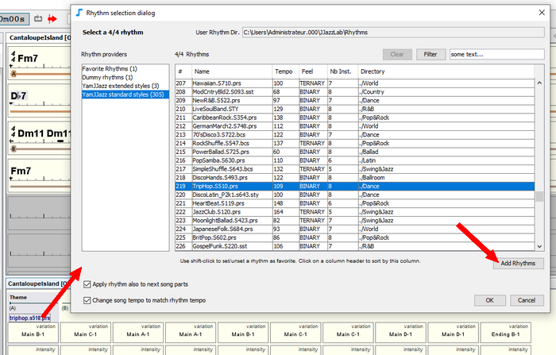

# Rhythm files

Rhythms are made available by [rhythm engines](../rhythm-engines/overview.md). Some rhythms can be based on **rhythm files**. 

For example the [YamJJazz rhythm engine](../rhythm-engines/yamjjazz-rhythm-engine/) provides rhythms built from Yamaha style files such as **poprock.sty** or **TripHop.S510.prs**.

## Rhythm files location 

JJazzLab expects rhythm files to be in the **User directory for rhythm Files**. The location of this directory can be changed in the **Options/Rhythms**. 


You can use up to 2 levels of sub-directories to organize the rhythms. Sub-directories whose name starts with an underscore '\_' are not scanned.


## Rhythm files scanning 

Your **rhythm files** are scanned at startup only upon a fresh install, and the rhythm list is saved into a **cache file**.

This cache file is then used to get the **rhythm list** upon next startups, which is much faster than the initial scanning -especially if you have many rhythm files. 


If you add or remove **rhythm files** in the **user directory for rhythm files** \(or a subdirectory\) you need to manually force a re-scan in order to update the cache file. This can be done in **Option/Rhythms** \(see image above\).


## Adding new rhythm files 

In order to avoid having too many files cluttering the **User directory for rhythm files**, the recommended way is:

1. **Test the rhythm files**  
   In the **rhythm selection dialog**, use the **Add Rhythms** button to load additional rhythm files for the current session only. These files can be anywhere on your hard drive.  
  
     

  
   Standard [Yamaha styles ](../rhythm-engines/yamjjazz-rhythm-engine/yamaha-styles.md)\(.sty, .prs, .sst or .bcs\) should appear in the **YamJJazz standard styles**, and [extended Yamaha styles](../rhythm-engines/yamjjazz-rhythm-engine/extended-yamaha-styles.md) \(.yjz\) should appear in the **YamJJazz extended styles**.   

2. **Copy the validated rhythm files** Once you have selected the “best” rhythm files, copy them somewhere in the **User Directory for Rhythm Files** \(see above\). 
3. **Force a Rescan from Options/Rhythms**


Quality of Yamaha style files found on the web vary a lot. Furthermore some styles are sometimes “broken” \(invalid file format\). If there is an error the corresponding rhythm won’t show up in the rhythm selection dialog.


