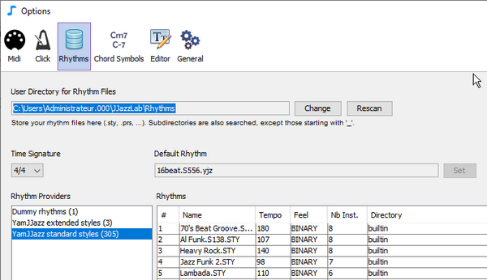
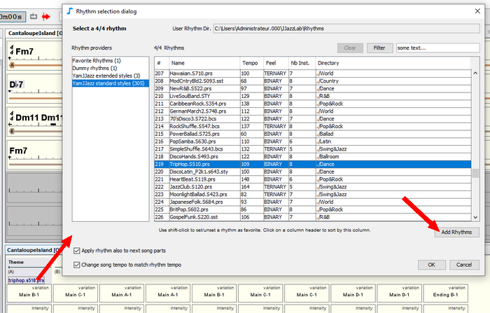

# リズムファイル

リズムは、[リズムエンジン](../rhythm-engines/overview.md)によって提供されます。いくつかのリズムは、**リズムファイル**を基礎としています。&#x20;

例えば、[YamJJazzリズムエンジン](../rhythm-engines/yamjjazz-rhythm-engine/)は、**poprock.sty**や**TripHop.S510.prs**などのヤマハスタイルファイルを基礎としたリズムを提供しています。

## リズムファイルの場所 

JJazzLab  はリズムファイルを **リズムファイル用のユーザーディレクトリ**に置くことを想定しています。このディレクトリの場所は、**Options/Rhythms**で変更することができます。&#x20;


リズムを整理するために、最大2階層のサブディレクトリーを使用することができます。サブディレクトリの名前がアンダースコア「\_」で始まるものはスキャンされません。


## リズムファイルのスキャン 

インストールして初めての起動時に**リズムファイル**をスキャンし、リズムリストを**キャッシュファイル**に保存します。

&#x20;このキャッシュファイルは、次回の起動時に **リズムリスト**を取得するために使用されるので、最初のスキャンよりもはるかに、特に多数のリズムファイルがある場合には、高速です。&#x20;


&#x20;もし、**リズムファイル**を**リズムファイル用ユーザーディレクトリ**またはサブディレクトリ）に追加または削除した場合は、キャッシュファイルを更新するために手動で再スキャンを行う必要があります。これは、**Option/Rhythms**で行うことができます（上の画像を参照）。


## 新しいリズムファイルの追加 

あまりに多数のファイルが**リズムファイル用のユーザーディレクトリ**に増えすぎないようにするには、以下の方法を推奨します：

1.  **リズムファイルのテスト**\
    **** まず、**リズム選択ダイアログ(rhythm selection dialog)**で**リズム追加(Add Rhythms)**を使って、現在のセッションのためだけに追加のリズムファイルをロードします。これらのファイルは、ハードディスクのどこにあってもかまいません。\
    \
    &#x20;&#x20;

    \
    標準的な[ヤマハスタイル](../rhythm-engines/yamjjazz-rhythm-engine/yamaha-styles.md)(.sty、.prs、.sst、.bcs) は、**YamJJazz standard styles**に、[拡張ヤマハスタイル](../rhythm-engines/yamjjazz-rhythm-engine/extended-yamaha-styles.md) (.yjz) は、**YamJJazz extended styles**に表示されます。\

2. **検証されたリズムファイルをコピーする**\
   **** 最適なリズムファイルを選んだら、それを**リズムファイル用ユーザーディレクトリ**のどこかにコピーします（上記参照）。\

3. **Options/Rhythmsから強制的に再スキャンする**


ヤマハスタイルファイルは、ウェブ上で公開されているものでも、その品質には大きなばらつきがあります。さらに、スタイルの中には、時々「壊れた」（無効なファイル形式）ものがあります。エラーが発生した場合、対応するリズムはリズム選択ダイアログに表示されません。

