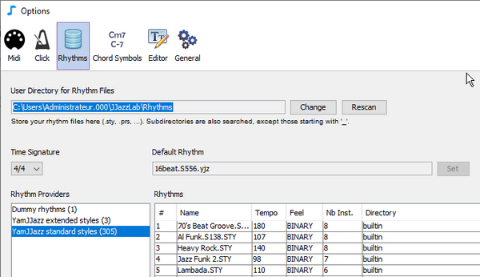

# Rhythm files


In JJazzLab "**rhythm**" usually means a **music style**, like pop or bossa-nova.


Rhythms are used by [songs](/broken/pages/-MQSAgDkeWdxuJiOjnJj). Many songs use only one rhythm (e.g. rock), but some may use 2 or more. A song file (.sng) does not contain all the rhythm data, it just keeps a reference to the rhythm's name.&#x20;

Upon first start, JJazzLab [scans ](rhythm-files.md#rhythm-files-scanning)the computer to get a list of the available rhythms.&#x20;

In JJazzLab core, rhythms are made available by [rhythm engines](../rhythm-engines/overview.md). Some rhythms can be based on **rhythm files**. For example the [YamJJazz rhythm engine](../rhythm-engines/yamjjazz-rhythm-engine/) provides rhythms built from Yamaha style files such as **poprock.sty** or **TripHop.S510.prs**.

## Rhythm files location 

JJazzLab expects rhythm files to be in the **User directory for rhythm files**. The location of this directory can be changed in the **Options/Rhythms**, as shown below.&#x20;

## Rhythm files scanning 

Your **rhythm files** are scanned at startup only upon a fresh install or an upgrade, and the rhythm list is saved into a **cache file**.

You can force a **rescan** in the **Options/Rhythms** panel as shown below.

<figure><figcaption>
Rescan button in the Options/Rhythms panel
</figcaption></figure>


You can use up to **2 levels of sub-directorie**s to organize the rhythms in the **User directory for rhythm files**. Sub-directories whose name starts with an underscore '**\_**' are **not** scanned.


This cache file is then used to get the **rhythm list** upon next startups, which is much faster than the initial scanning -especially if you have many rhythm files.&#x20;


Quality of Yamaha style files found on the web vary a lot. Furthermore some styles are&#x20;

sometimes “broken” (invalid file format), i.e. can't be loaded by JJazzLab.


## Adding new rhythm files 

Use the **Add Rhythms...** button from the **Options/Rhythms** panel (or from the [Rhythm selection dialog](../editors/song-structure.md#change-rhythm-music-style)).

<figure><figcaption>
Add Rhythms... button in the Options/Rhythms panel
</figcaption></figure>

Added rhythm files will be copied to the root of the **User directory for rhythm files**, and a **rescan** will be planned on next start.

In the **Add Rhythms...** dialog shown below, you can choose to add the rhythms **for the current session only**, i.e. rhythm files will NOT be copied in the **User directory for rhythm files**.

<figure><figcaption>
You may add rhythm files only for the current session
</figcaption></figure>


If, **outside of JJazzLab**, you add or remove rhythm files in the rhythm directory structure, **you MUST manually force a rescan**, otherwise the added/removed files will not be taken into account.

