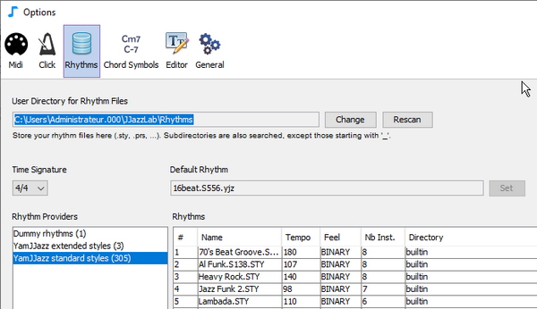

# Fichiers rythme


Dans JJazzLab, « **rhythm** » désigne généralement un **style musical**, comme le pop ou la bossa-nova.


Les rhythms sont utilisés par les songs. De nombreux songs n'utilisent qu'un seul rhythm (ex. rock), mais certains peuvent en utiliser 2 ou plus. Un fichier song (.sng) ne contient pas toutes les données du rhythm, il conserve simplement une référence au nom du rhythm.

Lors du premier démarrage, JJazzLab [scanne](rhythm-files.md#rhythm-files-scanning) l'ordinateur pour obtenir la liste des rhythms disponibles.

Dans JJazzLab, les rhythms sont mis à disposition par des [rhythm engines](../moteurs-rythmiques/overview.md). Certains rhythms peuvent être basés sur des **fichiers rythme**. Par exemple, le [rhythm engine YamJJazz](../moteurs-rythmiques/yamjjazz-rhythm-engine/) fournit des rhythms construits à partir de fichiers de style Yamaha tels que **poprock.sty** ou **TripHop.S510.prs**.

## Emplacement des fichiers rythme 

JJazzLab s'attend à ce que les fichiers rythme se trouvent dans le **répertoire utilisateur pour les fichiers rythme**. L'emplacement de ce répertoire peut être modifié dans **Options/Rhythms**, comme indiqué ci-dessous.

## Analyse des fichiers rythme 

Vos **fichiers rythme** sont analysés au démarrage uniquement lors d'une nouvelle installation ou d'une mise à jour, et la liste des rhythms est enregistrée dans un **fichier cache**.

Vous pouvez forcer une **nouvelle analyse** dans le panneau **Options/Rhythms** comme indiqué ci-dessous.

<figure><figcaption>
Bouton Rescan dans le panneau Options/Rhythms
</figcaption></figure>


Vous pouvez utiliser jusqu'à **2 niveaux de sous-répertoires** pour organiser les rhythms dans le **répertoire utilisateur pour les fichiers rythme**. Les sous-répertoires dont le nom commence par un tiret bas '**\_**' ne sont **pas** analysés.


Ce fichier cache est ensuite utilisé pour obtenir la **liste des rhythms** lors des prochains démarrages, ce qui est beaucoup plus rapide que l'analyse initiale, surtout si vous avez de nombreux fichiers rythme.


La qualité des fichiers de style Yamaha trouvés sur le web varie beaucoup. De plus, certains styles sont parfois « cassés » (format de fichier invalide), c'est-à-dire qu'ils ne peuvent pas être chargés par JJazzLab.


## Ajout de nouveaux fichiers rythme 

Utilisez le bouton **Add Rhythms...** depuis le panneau **Options/Rhythms** (ou depuis la [boîte de dialogue de sélection du rhythm](../editeurs/song-structure.md#change-rhythm-music-style)).

<figure><figcaption>
Bouton Add Rhythms... dans le panneau Options/Rhythms
</figcaption></figure>

Les fichiers rythme ajoutés seront copiés à la racine du **répertoire utilisateur pour les fichiers rythme**, et une **nouvelle analyse** sera planifiée au prochain démarrage.

Dans la boîte de dialogue **Add Rhythms...** affichée ci-dessous, vous pouvez choisir d'ajouter les rhythms **pour la session en cours uniquement**, c'est-à-dire que les fichiers rythme ne seront PAS copiés dans le **répertoire utilisateur pour les fichiers rythme**.

<figure><figcaption>
Vous pouvez ajouter des fichiers rythme uniquement pour la session en cours
</figcaption></figure>


Si, **en dehors de JJazzLab**, vous ajoutez ou supprimez des fichiers rythme dans la structure de répertoires des rhythms, **vous DEVEZ forcer manuellement une nouvelle analyse**, sinon les fichiers ajoutés/supprimés ne seront pas pris en compte.

