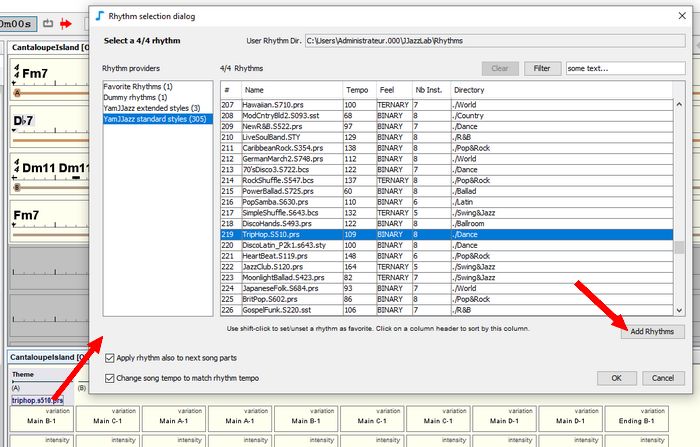

# Fichiers rythme

Les rythmes sont rendus disponibles par des [moteurs rythmiques](../moteurs-rythmiques/overview.md). Certains rythmes peuvent être basés sur des **fichiers rythmiques**.

Par exemple, le [moteur de rythme YamJJazz](../moteurs-rythmiques/yamjjazz-rhythm-engine/) fournit des rythmes construits à partir de fichiers de style Yamaha tels que **poprock.sty ou TripHop.S510.prs**.

## Emplacement des fichiers rythme 

JJazzLab s’attend à ce que les fichiers rythmiques se trouvent dans le **répertoire Utilisateur** pour les fichiers rythme. L’emplacement de ce répertoire peut être modifié dans les **Options/Rythmes**.&#x20;


Vous pouvez utiliser jusqu’à 2 niveaux de sous-répertoires pour organiser les rythmes. Les sous-répertoires dont le nom commence par un trait de soulignement '\_' ne sont pas analysés.


## Analyse des fichiers rythme 

Vos f**ichiers rythme** sont analysés au démarrage uniquement lors d’une nouvelle installation, et la liste de rythme est enregistrée dans un **fichier caché**.

Ce fichier caché est ensuite utilisé pour obtenir la **liste de rythmes** lors des prochains démarrages, ce qui est beaucoup plus rapide que l’analyse initiale, surtout si vous avez de nombreux fichiers rythmiques.&#x20;


Si vous ajoutez ou supprimez des fichiers de rythme dans le **répertoire utilisateur pour les fichiers de rythme** (ou un sous-répertoire), vous devez forcer manuellement une nouvelle analyse afin de mettre à jour le fichier caché. Cela peut être fait dans **Option/Rythmes** (voir image ci-dessus).


## Ajout de nouveaux fichiers rythme 

Afin d’éviter d’avoir trop de fichiers encombrant le **répertoire Utilisateur pour les fichiers rythmiques**, la méthode recommandée est:

1.  **Testez les fichiers rythmiques**\
    Dans la **boîte de dialogue de sélection du rythme**, utilisez le bouton Ajouter des rythmes pour charger des fichiers de rythmes supplémentaires pour la session en cours uniquement. Ces fichiers peuvent se trouver n’importe où sur votre disque dur.\
    \
    &#x20;&#x20;

    \
    Les [styles Yamaha](../moteurs-rythmiques/yamjjazz-rhythm-engine/yamaha-styles.md) standards (.sty, .prs, .sst or .bcs) doivent apparaître dans les **styles standards YamJJazz** et les [styles Yamaha étendus](../moteurs-rythmiques/yamjjazz-rhythm-engine/extended-yamaha-styles.md) (.yjz) doivent apparaître dans les **styles étendus YamJJazz**.  
2. **Copiez les fichiers rythmiques validés**\
   Une fois que vous avez sélectionné les "meilleurs" fichiers rythmiques, copiez-les quelque part dans le **répertoire utilisateur des fichiers rythmiques** (voir ci-dessus). 
3. **Forcez une nouvelle analyse à partir d’options/rythmes**


La qualité des fichiers de style Yamaha trouvés sur le Web diverge beaucoup. De plus, certains styles sont parfois "cassés" (format de fichier invalide). S’il est en erreur, le rythme correspondant n’apparaîtra pas dans la boîte de dialogue de sélection du rythme.

