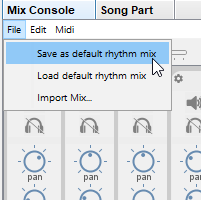

# Song and mix files

When you save a song called **mySong**, JJazzLab actually saves 2 different files:

* **mySong.sng**: contains everything except the mix information
* **mySong.mix**: contains only the mix information, i.e. the configuration of the instruments used.

Why using 2 different files ?

Because the mix information is specific to your [output synth](../configuration/output-synth.md). Integrating the mix data in the .sng file would make .sng files not portable between users, since users have different output synths.

When you open **mySong.sng**, JJazzLab also opens **mySong.mix** in the same directory. If **mySong.mix** does not exist then JJazzLab creates the mix using the [default rhythm mix](song-and-mix-files.md#default-rhythm-mix).

## Default rhythm mix

Each JJazzLab rhythm has a builtin default mix. This builtin default mix can only use **GM instruments** for maximum portability.

You can override the rhythm's builtin mix by saving a **default rhythm mix** file.  Unlike the builtin mix, **this rhythm mix can use any instruments**.

By default this file is stored in the **user rhythm directory** set in **Options/Rhythms. **But the directory can be changed in **Options/General**.

## Mix file lookup order

Combining the 2 paragraphs above, below is how JJazzLab looks for mix information when you load **myDir/mySong.sng **and this songs uses rhythm **16BeatRock **:

1. use **myDir/mySong.mix** if present\

2. use **defaultRhythmMixDir/16BeatRock.mix** if present\

3. use **16BeatRock **builtin default mix (GM instruments only)

Steps 2. and 3. are also used when you add a new rhythm in a song.
