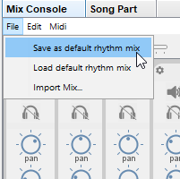

# Song and mix files

When you save a song called **mySong**, JJazzLab actually saves 2 different files:

* **mySong.sng**: contains everything except the mix information, i.e. the chord leadsheet, the song structure, the reference to the rhythm used (e.g. "16beat.s456.sty").
* **mySong.mix**: contains only the mix information, i.e. which instrument is used by each track, and with which configuration (volume, reverb, pan, ...).

Why using 2 different files ?

Because the mix information is specific to your output synth ([FluidSynth ](../sounds/using-fluidsynth.md)or a [custom synth](../sounds/other-synths.md)). Integrating the mix data in the .sng file would make .sng files not portable between users, since users have different output synths.

When you open **mySong.sng**, JJazzLab also opens **mySong.mix** in the same directory. If **mySong.mix** does not exist then JJazzLab creates the mix using the [default rhythm mix](song-and-mix-files.md#default-rhythm-mix).


When loading a song file (.sng),  if the rhythm reference (e.g. "MediumJazz.s637.sst") used by this song is not available, JJazzLab substitutes another rhythm available on the system. JJazzLab tries its best to find a "similar" rhythm based on the name (another "jazz" rhythm in the example above). If it can't find a suitable rhythm, it just uses the default rhythm for the time signature.


## Default rhythm mix

#### Principle

When you create a song and select a new rhythm (e.g. `MediumJazz.s637.sst`), JJazzLab looks for a **default rhythm mix** file (`MediumJazz.s637.mix`) to initialize the song mix for this rhythm.&#x20;

The default rhythm mix lets you define **an optimized rhythm mix adapted to your output synth** ([FluidSynth ](../sounds/using-fluidsynth.md)or a [custom synth](../sounds/other-synths.md)): e.g. for `MediumJazz.s637.sst` make the electric guitar quieter, replace the default GM bass instrument by a better one available on your synth, and mute that trumpet you don't like.


**If the default rhythm mix file is not present**, JJazzLab uses the builtin information inside the rhythm file and the capabilities of your output synth ([FluidSynth ](../sounds/using-fluidsynth.md)or a [custom synth](../sounds/other-synths.md)) in order to **infer an appropriate mix**. With FluidSynth it will work OK most of the time. With a custom synth, it might be less optimized.


#### Save a default rhythm mix

In the mix console, adjust the mix for your rhythm until you're satisfied, then use **Save as default rhythm mix** from the Mix console menu, as shown below.

The default rhythm mix file is saved **in the same directory than the rhythm file**. JJazzLab will now use it automatically each time you select the corresponding rhythm in a song.

If you made changes to the song mix but you're not satisfied with those changes, you can re-initialize the song mix with the default rhythm mix using **Load default rhythm mix** in the Mix console menu.

## Mix file lookup order

Combining the 2 paragraphs above, below is how JJazzLab looks for mix information when you load **myDir/mySong.sng** and this songs uses rhythm **16BeatRock** :

1. use **myDir/mySong.mix** if present\

2. use **defaultRhythmMixDir/16BeatRock.mix** if present\

3. use **16BeatRock** builtin default mix

Steps 2. and 3. are also used when you add a new rhythm in a song.
