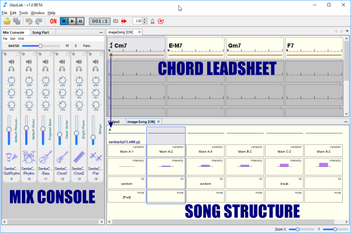

# ソングエディター

&#x20; [**コードリードシートエディター**](chord-lead-sheet.md) (Chord lead sheet editor)を使用する場面は、：

* コード記号（例：Cm6、Ab7）の追加
* セクションの追加（"A"、"B"、"バース"、"コーラス"...など）
* コードの移動や編集によるリズムアクセント、解釈、ハーモニーの調整

[**ソング構成エディター**](song-structure.md) (Song structure editor)を使用する場面は、：

* セクションの順序決定（例："AABA"、"ヴァース ヴァース コーラス ヴァース"など&#x20;
* 使用するリズムの選択&#x20;
* リズム設定パラメーターの調整による、バリエーション、強弱、フィルイン、楽器のミュートなどのメリハリ追加

[**ミックスコンソール**](mix-console.md) (Mix console)は、各リズム楽器のミックスを調整：

* サウンドデバイスで使用する楽器を選択
* ボリューム、パン、リバーブ、コーラス音響の調整&#x20;
* ミュート、ソロ、トランスポーズ
