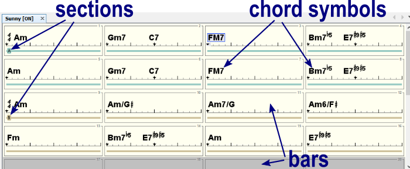
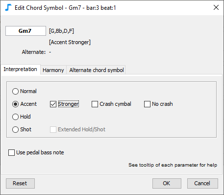
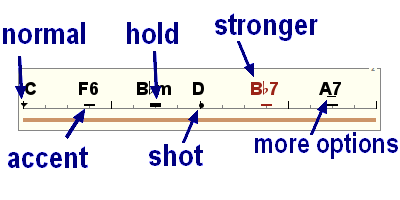
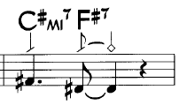
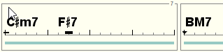
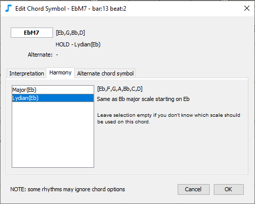
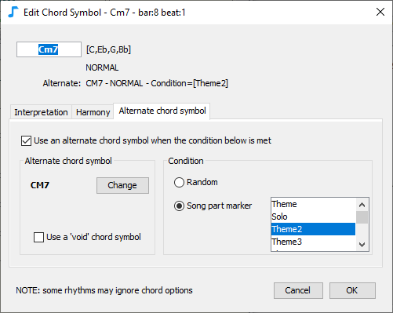
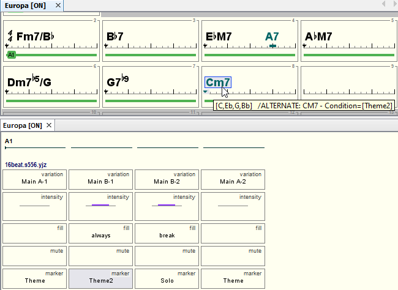
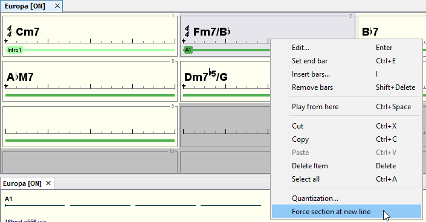
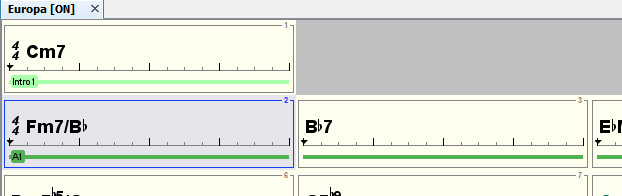

# コードリードシート

**コードリードシートエディター** \(Chord lead sheet editor\)を使用する場面は、：

* コード記号の追加: 例 **Cm6, Ab7**
* セクションの追加: 例 **"A"、"B"、"ヴァース"、"コーラス**"...など
* コードの拍の移動や、アクセント、解釈、モードスケールの編集による調整

## コード記号

### 入力

小節またはコード記号を選択します。：

* コード記号の最初の文字（A～G）を入力する、または
* ENTERキーを押す、または
* ダブルクリック、または
* 右クリックメニューで「編集」

また、既存のコード記号を選択してコントロールボタンを押しながら移動すると、編集可能な新しいコピーが作成されます。

コード記号の移動は、コード記号を選択してマウスで移動させます。

リードシートのサイズを変更するには、小節を選択して右クリックメニューから**Set end bar**を選択します。

複数選択する場合はctrl+clickまたはshift+clickを使用してください。


最初からリードシートを入力するには、最初の小節を選択し、コード記号を直接入力してENTERを押し（自動的に次の小節が選択されます）、2番目の小節のコード記号を入力する、などの方法が簡単です。


### 様々なコード表記

JJazzLabでは、各コード記号に対して多くの別名を認識しています。例えば、C7MはCmaj7、Cma7、CM7、CMAJ7などと書くことができます。

別名を追加するには、メニューから **Options→Chord Symbols**を選択します。

### 解釈\(Interpretation\)

コード記号を選択して、編集（ダブルクリック、エンターキー、または右クリックメニュー）にある、**Interpretation**タブを選択します。

**解釈\(Interpretation\)**タブでは、このコード・シンボルをどのように演奏するかを決定します:

* **Normal**\(通常\)
* **Accent**\(アクセント\): リズミカルなアクセントを加え、クラッシュシンバルをランダムに演奏します。アクセントを強くしたり、クラッシュシンバルを鳴らしたり鳴らさなかったりすることができます。
* **Hold**\(持続\): リズミカルなアクセントを加え、次のコード記号まで音を持続します。拡張\(Extended\)した場合、より多くの楽器を持続します。
* **Shot**\(ショット\): リズミカルなアクセントを加え、コード音を短く演奏します。拡張\(Extended\)した場合、より多くの楽器のショットになります。
* **Pedal bass**\(ペダルベース\): ベースラインでベース音のみを演奏します（例：Fm7ならF、Fm7/CならC）。この設定は、スラッシュコードを入力したときにデフォルトでオンになります。


リズム生成エンジンによって、これらの解釈パラメーターの表示が異なる場合があります。


  
 コード記号の下に表示されるマーカーの形状は、解釈モードによって異なってきます:

例えば、このように表現するためには : 

次のような解釈パラメーターが使用できるでしょう。: 


選択したコードの解釈を変更するキーボードショートカットは下の方を参照してください。


### モードスケール\(Harmony\)

モードスケールを設定するには、コード記号を選択して編集にある**Harmony**タブを選びます。

この**Harmony**タブでは、選んだコード記号を表現する際に使用するスケールを選択できます。

**例** Eb△7のときに、基準のベースラインに、Ab（Ebメジャースケールの4度）が含まれているとします。リディアンモード（\#11度がある）を選択した場合、このコード記号の基準のベース音AbはAとして演奏されます。

初期設定では音階は選択されていません。各リズム生成エンジンが「最適な」音階を決定します。

### コードの代替

代替のコードを設定するには、コード記号を選択して編集にある**substitute** タブを選びます。

このタブでは、いくつかの条件が満たされたときに使用される**代替\(Substitute\)**可能なコード記号を定義できます。 

**代替**コード記号は、曲の一部にちょっとした変化をつけたいときに便利です。

**代替**コード記号は、どんなコード記号でも、どんな解釈でも、どんなハーモニーでも構いません。また、コード記号が全くない状態（voidコード）も可能です。**代替**コード記号が定義されているコード記号は、別の色で表示されます。（下の画像参照）。

_例：_

カルロス・サンタナの「哀愁のヨーロッパ」では、テーマの1回目のエンディングはCm7ですが、2回目のエンディングはCM7です。これをJJazzLabで実現するには、セクションA1を複製して、異なるエンディングを持つセクションA2を作り、それに合わせて曲の構成を変更するという方法があります。この方法でも問題はありませんが、変更がわずかな場合には、**代替**コード記号を使う方がより簡単でしょう。

下の図（および上のダイアログのスナップショット）では、CM7の**代替**コードが作成されています。CM7は、曲のすべてのパートで使用されます（[ソング構成エディター](song-structure.md)\) 。 マーカーがテーマ\(Theme\)2に設定されている部分です。下の画像では、CM7は2つ目のソングパートでのみ使用されることを意味します。

3小節目にも**代替**コード記号の例があります。A7です。 原曲を聴いてみると原曲を聴いてみると、ソロの時だけ3小節目の最後の拍でA7を弾いていることに気づくでしょう。ソロの時だけです。そこで、A7のコード記号は、その**代替**コード記号はソロ"以外"では「ボイド\(void\)コード記号」\(コード記号が書いてないのと同じ\)と定義します。

## セクション入力

一般的なセクションとは、「イントロ」「ヴァース」「コーラス」などです。

ソングセクションとは、JJazzLabが曲の構造を定義するために使用する基本的な単位です。最初の小節には必ず定義されたセクションがあります。

セクションを追加するには、終端ではない小節を選択し、その次に：

* ENTERキー、または
* ダブルクリック、または
* 右クリックの編集\(Edit\)

新しいセクション名は、既存のセクション名とは異なるものでなければなりません。

### セクションを新しい行に強制する

列で途中の小節にあるセクションを、強制的に次の行から開始させることができます。これはセクションの小節数が奇数の場合に便利です。

セクションが定義されている小節を選択するかセクション自体を選択し、右クリックメニューで「Force Section at New Line\(セクションを新しい行に強制する\)」を選択します。

  下のような表示になります。

## マウスショートカット

| 対象 | マウス | 動作 |
| :--- | :--- | :--- |
| 小節、コード記号、セクション | クリック | 選択 |
| コード記号 | ダブルクリック | コード記号エディターを使用する編集 |
| 小節、セクション | ダブルクリック | 小節エディターを使用する編集 |
| 小節、コード記号、セクション | 右クリック | ポップアップメニュー |
| コード記号 | マウスホイール | 移調 |
| エディター | ctrl+マウスホイール | 水平方向のズーム変更 |

## キーボードショートカット


動作の多くは、コンテキストメニュー（Windows/Linuxでは右クリック、MacではCtrlキーを押しながらクリック）でも利用でき、また利用できる場合は関連するキーボードが表示されます。


| 対象 | キー | 動作 |
| :--- | :--- | :--- |
| コード記号 | enter | コード記号エディターを使用する編集 |
| 小節、セクション | enter        | 小節エディターダイアログで編集 |
| 小節 | ctrl+E | 最終小節を設定 |
| 小節 | I | 小節挿入 |
| 小節 | delete | 小節の内容クリア |
| コード記号、セクション | delete | 除去 |
| コード記号、セクション | ctrl+left/right | アイテムを1小節左右に移動 |
| 小節 | shift+delete | 除去 |
| コード記号 | ctrl+up/down | 移調 |
| コード記号 | P | 解釈変更 |
| コード記号 | S | 強めのアクセント |
| コード記号 | H | クラッシュシンバルの有無 |
| コード記号 | X | より多数の楽器の保持／ショット |
| コード記号、セクション | ctrl+A | 全セクション選択後、リードシート内へ |
| 小節、コード記号、セクション | ctrl+C/X/V | コピー/切り取り/ペースト |
| エディター | ctrl+Z/Y | 取り消し／やり直し |
| エディター | ctrl+O | ソングアクティブのオン／オフセット |
| エディター | ctrl+W | ソングを閉じる |

