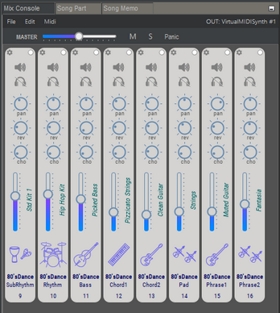

# ミックスコンソール

**ミックスコンソール**を使用する場面は：

* 楽器の変更
* チャンネル設定の調整：音量、リバーブ、コーラス、パン、移調、ベロシティオフセット
* チャンネルのミュートまたはソロ
* .mixファイルの読み込み／保存
* さらには：MIDIチャンネルの変更、特別なMIDIコマンドの使用、等々

 JJazzLabは、**ミックスコンソール**の情報を使って、関連するMIDIメッセージを[シンセ出力](../../configuration/output-synth.md)に送ります。これは、ミックスコンソールで変更を加えるたびに、あるいはプレイバックを開始するときに行われます。


MIDIは16チャンネルだけしかありません。そのため、通常では1曲に2つ以上のリズムはできません。


## ミックスコンソールメニューバー

### ファイル\(File\)

* **初期リズムミックスのLoad/Save\(Load/Save Default Rhythm Mix\)**  

  ファイルから現在のミックスを変更します。.mixファイルの情報は[本ページ](../song-and-mix-files.md) を良く読んでください。

* **ミックスのインポート\(Import Mix...\)**  

  現在のミックスとインポートしたミックスで共通する楽器の設定のみがインポートされることに注意してください。

### 編集\(Edit\)

* **ユーザーチャンネルの追加／削除\(Add/Remove user channel\)**   

  ユーザーチャンネルは、曲やリズムに合わせて、演奏したい楽器を自動的に設定するためのものです。  

  _例：あなたはキーボーディストで、JJazzLabがシンセサイザーに接続されています。Stevie Wonderの "Isn't she lovely "という曲を作り、そこにクラビネットの音を入れて演奏します。クラビネットの音でユーザーチャンネルを追加し、コーラス効果を強めてから、曲を保存します。こうすれば、次に曲をロードしたときに、自動的にシンセサイザーでクラビネットサウンドが再現されます。_  

* **チャンネルのリセット\(Reset channels\)**  

  関連するリズムから元の設定に戻します。

### MIDI

* **全てのMIDIパラメーターの有効／無効\(Enable/Disable all Midi parameters\)**  

  全てのMIDIパラメーターの有効／無効は、ミックスをシンセ出力に直接自力でコントロールするときに使います。

* **GM/GM2/XG/GMモードでONメッセージを送る\(Send GM/GM2/XG/GM mode ON message\)**  

  これにより、特別MIDI初期化メッセージをシンセ出力に希望のモードで送ることができます。

## 楽器の変更\(Change instrument\)

チャンネル内の楽器名をクリックします。また、ここでは楽器の移調調整もできます。

## チャンネル設定\(Channel settings\)

チャンネル設定の使い方は以下の通りです。

* **このチャンネルで演奏されるすべての音にMIDIベロシティオフセットを追加する \(Add a Midi velocity offset to all notes played on this channel\)**  

  音量調整とは少し違いますのでご注意ください。.  

* **特定のMIDIメッセージ送信を中止する\(Disable sending specific Midi messages\)**  

  おそらく、自分で直接パラメータを[シンセ出力](../../configuration/output-synth.md)でコントロールしているためと思われます。  

* **チャンネルドラムに drums-rerouting を使用\(Use drums-rerouting for channels drums\)**  

  基本的なGM出力のシンセサイザーを使用した場合、**チャンネル10でのみ**ドラムを演奏することができます。ミックス内の他のチャンネルでドラム/パーカッションが使用されている場合は、これらのチャンネルでドラムのリルートを有効にする必要があります。なお、JJazzLab は、現在の[シンセ出力](../../configuration/output-synth.md)の情報に基づいて潜在的な問題を検出した場合、このオプションを有効にすることがあります。   

## MIDIチャンネル

各MIDIチャンネルは手動で変更できます。

## 複数のリズムがあるソング

曲の中で2つ以上のリズムが使われている場合は、ミックスコンソールの左上にポップアップが表示され、表示したいリズムを選択することができます。

ただし、**Edit/Reset channels\(チャンネルの編集／リセット\)**などの一部のコマンドは、隠しリズムには適用されません。

## マウスショートカット

| 対象 | マウス | 動作 |
| :--- | :--- | :--- |
| チャンネルボリュームスライダー、つまみ | ダブルクリック | キーボードによる値入力 |
| チャンネルボリュームスライダー | shift + マウスドラッグ | 全チャンネルのボリューム変更 |

