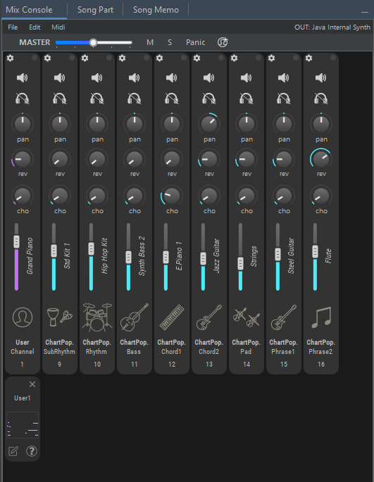
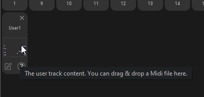

# ミックスコンソール

**ミックスコンソール**を使用する場面は：

* 楽器の変更
* チャンネル設定の調整：音量、リバーブ、コーラス、パン、移調、ベロシティオフセット
* チャンネルのミュートまたはソロ
* .mixファイルの読み込み／保存
* さらには：MIDIチャンネルの変更、特別なMIDIコマンドの使用、等々

&#x20;JJazzLabは、**ミックスコンソール**の情報を使って、関連するMIDIメッセージを[シンセ出力](broken-reference)に送ります。これは、ミックスコンソールで変更を加えるたびに、あるいはプレイバックを開始するときに行われます。


MIDIは16チャンネルだけしかありません。そのため、通常では1曲に2つ以上のリズムはできません。


## ミックスコンソールツールバー

* **マスターボリューム**(Master)：MIDIボリュームメッセージの増減
* **M**：全てのトラックのミュート／ミュート解除
* **S**：全てのトラックのソロ切り替え
* **パニック**(Panic)：MIDIパニックメッセージを送信し、全ての音を消す
* **ユーザートラック**：ユーザートラック追加。[ユーザートラック](mix-console.md#yztorakku)については以下を参照。

## ミックスコンソールメニューバー

### メニューファイル(Menu File)

*   **初期リズムミックスのLoad/Save(Load/Save Default Rhythm Mix)** &#x20;

    ファイルから現在のミックスを変更します。.mixファイルの情報は[本ページ](../song-and-mix-files.md) を良く読んでください。
*   **ミックスのインポート(Import Mix...)** &#x20;

    現在のミックスとインポートしたミックスで共通する楽器の設定のみがインポートされることに注意してください。

### メニュー編集(Menu Edit)

*   **チャンネルのリセット(Reset channels)** &#x20;

    関連するリズムから元の設定に戻します。

### メニューMIDI(Menu MIDI)

*   **全てのMIDIパラメーターの有効／無効(Enable/Disable all Midi parameters)** &#x20;

    全てのMIDIパラメーターの有効／無効は、ミックスをシンセ出力に直接自力でコントロールするときに使います。
*   **GM/GM2/XG/GMモードでONメッセージを送る(Send GM/GM2/XG/GM mode ON message)** &#x20;

    これにより、特別MIDI初期化メッセージをシンセ出力に希望のモードで送ることができます。

## 楽器の変更(Change instrument)

チャンネル内の楽器名をクリックします。また、ここでは楽器の移調調整もできます。

## チャンネル設定(Channel settings)

チャンネル設定の使い方は以下の通りです。

*   **このチャンネルで演奏されるすべての音にMIDIベロシティオフセットを追加する (Add a Midi velocity offset to all notes played on this channel)** &#x20;

    音量調整とは少し違いますのでご注意ください。\

*   **特定のMIDIメッセージ送信を中止する(Disable sending specific Midi messages)** &#x20;

    おそらく、自分で直接パラメータを[シンセ出力](broken-reference)でコントロールしているためと思われます。\

*   **チャンネルドラムに drums-rerouting を使用(Use drums-rerouting for channels drums)** &#x20;

    基本的なGM出力のシンセサイザーを使用した場合、**チャンネル10でのみ**ドラムを演奏することができます。ミックス内の他のチャンネルでドラム/パーカッションが使用されている場合は、これらのチャンネルでドラムのリルートを有効にする必要があります。なお、JJazzLab は、現在の[シンセ出力](broken-reference)の情報に基づいて潜在的な問題を検出した場合、このオプションを有効にすることがあります。 \

## MIDIチャンネル

各MIDIチャンネルは、チャンネル番号をクリックするだけで、手動で変更できます。

.png>)

## ユーザートラック

ミックスコンソールツールバーのユーザートラック追加\[Add user track]ボタンを使用して、1つまたは複数のユーザートラックを追加します（上図参照）。

ユーザートラックにMIDIノートを追加するには、MIDIファイルを長方形の領域に**ドラッグ＆ドロップ**するか、左下にある**Edit via external Midi editor**ボタンを使用します。

**Edit via external Midi editor**で編集する場合、JJazzLabはまずバッキングトラック全体を一時的なMIDIファイルとしてエクスポートしますので、それを外部MIDIエディタで開けばユーザートラックに音を追加できるようになります。


JJazzLabは、ユーザートラックのMIDIチャンネルに一致する音符だけを取り込みます。他のMIDIチャンネルからの音符は無視されます。

例えば、上の画像ではユーザートラックのチャンネルは1なので、MIDIエディタやDAWを使ってユーザートラックに音を追加するときは、チャンネルが1であることを確認してください。


**Edit via external Midi editor**で編集するには、オプション/プリファレンス(**Options/Preferences**)の一般(**General**)パネルで外部MIDIエディターを設定する必要があります。もし、お持ちでない場合は、Windows用の**MidiEditor**が無料、オープンソース、軽量ですのでお勧めします。

## マウスのドラッグ＆ドロップでMIDIファイルのエクスポート

ミックスコンソールの空いている部分からマウスドラッグでバッキングトラック全体をMIDIファイルにエクスポートすることができます。これはメニューのFile/Export to Midi fileと同じですが、DAWなど他のソフトウェアで作業するときにより便利なので注目してください。

一つのトラックをエクスポートするには、トラックアイコンからマウスドラッグを開始します。

## 複数のリズムがあるソング

曲の中で2つ以上のリズムが使われている場合は、ミックスコンソールの左上にポップアップが表示され、表示したいリズムを選択することができます。

ただし、**Edit/Reset channels(チャンネルの編集／リセット)**などの一部のコマンドは、隠しリズムには適用されません。

## マウスショートカット

| 対象                  | マウス             | 動作             |
| ------------------- | --------------- | -------------- |
| チャンネルボリュームスライダー、つまみ | ダブルクリック         | キーボードによる値入力    |
| チャンネルボリュームスライダー     | shift + マウスドラッグ | 全チャンネルのボリューム変更 |
