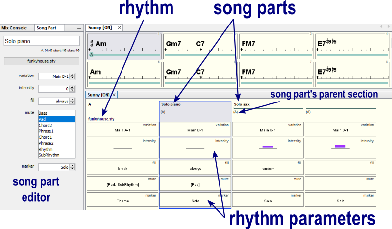
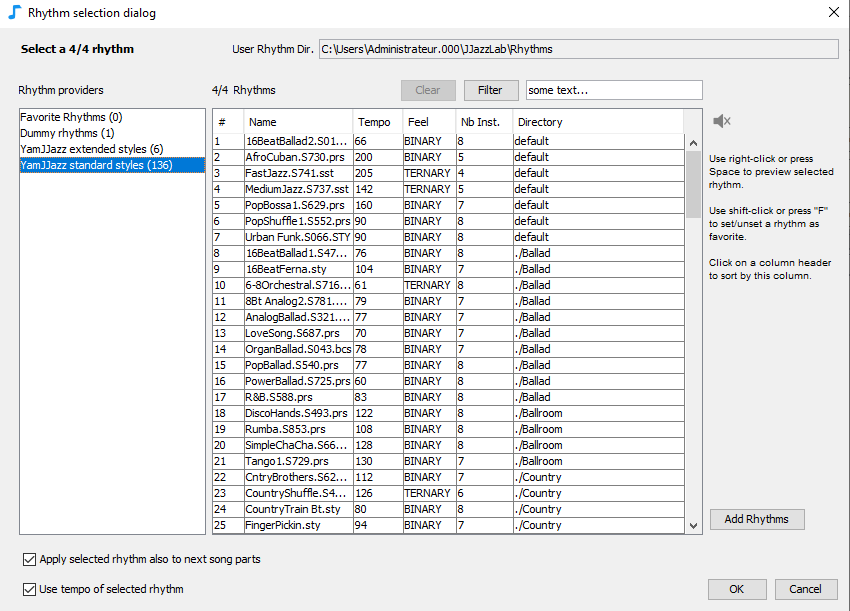

# ソング構成

**ソング構成エディター** を使う場面は、：

* 楽曲のセクションの順番を決めます。例えば、"AABA"や、 "ヴァース ヴァース コーラス ヴァース"といった感じです。
* 使用する**リズム**を選択します。 
* **リズム設定パラメーター**\(rhythm parameters\)を調整して、セクションでのバリエーション、強弱\(intensity\)、楽器のミュートなどのメリハリを出します。

## ソングパート\(Song parts\)

**ソングパート**は、[コードリードシート](chord-lead-sheet.md)の親**セクション**と関連しています。

ソングパートには、名前が一つ、 **リズム**が一つ、そして**リズム設定パラメーター**\(variation、intensity、fill、mute、maraker\)にそれぞれ一つの値があります。

新しいソングパートの追加：

* コードリードシートからセクションをソング構成エディターにドラッグするか、
* メニューを右クリックして挿入\(**Insert**\)するか、
* 既にあるソングパートをコピー: ctrlキーを押しながらドラッグしてコピー&ペースト、もしくは右クリックして複製\(**Duplicate**\)します。

デフォルトでは、ソングパートの名前は親セクションの名前になっています。ソングパートの名前が変更された場合は、親セクションが名前の下に表示されます。

いくつかの連続したソングパートが同じ名前を持つ場合、名前は最初のソングパートにのみ表示され、連続したソングパートには線が表示されます。この線をクリックすると、関連するすべてのソングパートが選択されます。

ソングパートは、マウスでドラッグすることで並び替えることができます。

## 編集

ソングパートの **名前**、**リズム**、そして**リズム設定パラメーター**の値は変更可能です。

編集は、ソング構成エディターの中から [マウス](song-structure.md#mouse-shortcuts)を使って直接行うか、または**ソングパートエディター**（ページ上部のスナップショット参照）で行います。編集した値は、選択したすべてのソングパートまたはリズム設定パラメーターに影響します。

キーボードの**R**ボタンを押すか、リズム名をクリックすると、**リズム選択ダイアログ**が表示されます。

リズムを変更すると、JJazzLab は以前のリズム設定パラメーターの値を新しいリズム設定パラメーターに合わせようとします。


MIDIは16チャンネルしか対応できず、たいていのリズムは7～8個の楽器を使用します。そのため、2つ以上のリズムを持つ曲を作ることは現実的には困難です。


## マウスショートカット

| 対象 | マウス | 動作 |
| :--- | :--- | :--- |
| ソングパート、リズム設定パラメーター | クリック | select |
| ソングパート | ダブルクリック | edit song part name |
| ソングパート名 | クリック | edit  |
| リズム | クリック | select a rhythm |
| エディター、ソングパート、リズム設定パラメーター | 右クリック | open popup menu |
| リズム設定パラメーター | ダブルクリック | edit value |
| リズム設定パラメーター | マウスホイール | change value |
| リズム設定パラメーター\(複数\) | shift+マウスホイール | make values identical then change value |
| エディター | ctrl+マウスホイール | change X zoom factor |

## キーボードショートカット


Many actions are also available via the context menu \(right-click on Windows/Linux, ctrl-click on Mac\), and when available the associated shortcut is displayed.


| 対象 | キー | 動作 |
| :--- | :--- | :--- |
| ソングパート、リズム設定パラメーター | enter | edit song part name |
| ソングパート、リズム設定パラメーター | R | select rhythm |
| ソングパート、リズム設定パラメーター | I | insert song part |
| ソングパート、リズム設定パラメーター | ctrl-I | append song part |
| ソングパート、リズム設定パラメーター | D | duplicate song part\(s\) |
| ソングパート | delete | delete song part\(s\) |
| リズム設定パラメーター | ctrl-up/down | next/previous value |
| リズム設定パラメーター | Z | reset param. value |
| ソングパート | ctrl-C/X/V | copy/cut/paste |
| エディター | ctrl-Z/Y | undo/redo |
| エディター | ctrl-F | zoom to fit width |

