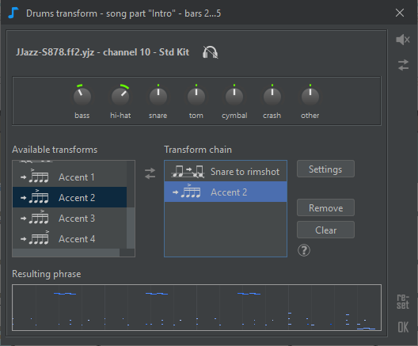

# ソング構成

**ソング構成エディター** を使う場面は、：

* 楽曲のセクションの順番を決めます。例えば、"AABA"や、 "ヴァース ヴァース コーラス ヴァース"といった感じです。
* 使用する**リズム**を選択します。&#x20;
* **リズム設定パラメーター**(rhythm parameters)を調整して、セクションでのバリエーション、強弱(intensity)、楽器のミュートなどのメリハリを出します。

.png>)

## ソングパート(Song parts)

**ソングパート**は、[コード譜](chord-lead-sheet.md)の親**セクション**と関連しています。

ソングパートには、名前が一つ、 **リズム**が一つ、そして**リズム設定パラメーター**(variation、intensity、fill、mute、maraker)にそれぞれ一つの値があります。

新しいソングパートの追加：

* コード譜からセクションをソング構成エディターにドラッグするか、
* メニューを右クリックして挿入(**Insert**)するか、
* 既にあるソングパートをコピー: ctrlキーを押しながらドラッグしてコピー&ペースト、もしくは右クリックして複製(**Duplicate**)します。

デフォルトでは、ソングパートの名前は親セクションの名前になっています。ソングパートの名前が変更された場合は、親セクションが名前の下に表示されます。

いくつかの連続したソングパートが同じ名前を持つ場合、名前は最初のソングパートにのみ表示され、連続したソングパートには線が表示されます。この線をクリックすると、関連するすべてのソングパートが選択されます。

## 編集

ソングパートは、マウスでドラッグすることで並び替えることができます。

ソングパートの **名前**、**リズム**、そして**リズム設定パラメーター**の値は変更可能です。

編集は、ソング構成エディターの中から [マウス](song-structure.md#mouse-shortcuts)を使って直接行うか、または**ソングパートエディター**（ページ上部のスナップショット参照）で行います。編集した値は、選択したすべてのソングパートまたはリズム設定パラメーターに影響します。

ポップアップメニュー（Windows/Linuxでは**右クリック**、Macでは**Ctrlキー+クリック**）により、以下の2つの画像に示すように、現在の選択項目で利用可能なコマンドを確認することができます。

連続する複数のリズムパラメーターを選択した場合、リズムパラメーターのポップアップメニューのサブメニューにある**Adjust values**\[設定値の調整］を使って、最初に選択した値と最後に選択した値の間に値を挿入することができます。 下の例では、テンポを100%から108%まで徐々に上げていくのに使っています。

## リズムの変更

ソングパートはそれぞれ独自のリズムにすることができます。


MIDIは16チャンネルしか対応できず、たいていのリズムは7～8個の楽器を使用します。そのため、2つ以上のリズムを持つ曲を作ることは現実的には困難です。


キーボードの**R**ボタンを押すか、リズム名をクリックすると、**リズム選択ダイアログ**が表示されます。

リズムを変更すると、JJazzLab は以前のリズム設定パラメーターの値を新しいリズム設定パラメーターに合わせようとします。

曲の途中のリズム変更を削除したい場合は、ソングパートを選択して、ソングパートのポップアップメニューから**Remove Rhythm Change**［リズム変更の削除］を使用します。

## リズム設定パラメーター

### 種類

理論的には、リズム（またはスタイル）は独自のパラメータを定義することができます。しかし、JJazzLabでは、ほとんどのリズムが同じパラメータを使用しています。

* **バリエーション**(Variation): リズムのバリエーション。[YamJJazzエンジン](../../rhythm-engines/yamjjazz-rhythm-engine/)のリズムは通常、4つのメインバリエーションと、いくつかのイントロ、エンディング、フィルを持っています。
* **強さ**(Intensity)：ほとんどのリズムエンジンは、このパラメータを使ってバッキングトラックの音のMIDIベロシティを増減させます。
* **ドラムフィル**(Drums fill)： JJazzLabは、曲の最後の小節にドラムのフィルを追加します。
* **ミュート**(Mute)：このパートで1つ以上の楽器をミュートします。このパラメータを編集するには、ソングパートエディタを使用すると便利です（このページの上部にあるスナップショットを参照してください）。
* **マーカー**(Marker)：このパラメータは、[ここ](chord-lead-sheet.md#kdono)で説明するように、コード譜で代替コード記号を使用する場合のみ有効です。
* **テンポ**(Tempo factor)：ソングパートのテンポを遅くしたり速くしたりします。
* **ドラミング変更**(Drums transform)：曲部分のドラムの音符を一部変更します。例えば、ハイハットの音を大きくしたり、クローズドハイハットの音をライドシンバルの音に変更したりできます。

* **カスタムフレーズ**(Custom phrase)：ソングパートの1つまたは複数の楽器フレーズを置き換えます。 カスタムフレーズを読み込むには、下図のカスタムフレーズエディタにMIDIファイルをドラッグ＆ドロップするか、**カスタマイズ**(Customize)ボタンを使って外部MIDIエディタを使用します。 **外部MIDIエディタで編集**する場合、JJazzLabはまずバッキングトラック全体を一時的なMIDIファイルとしてエクスポートしますので、それを外部MIDIエディタで開くと、1つまたは複数のトラックの音を変更できます。

### 値の編集

各ソングパートのパラメータの値を調整することができます。&#x20;

連続した値のパラメータの場合、選択してマウスホイールを使用するのが最も簡単な値の編集方法です。

&#x20;ですが、リズム設定パラメータのポップアップメニューを使用してパラメータ値をリセットしたり、値をコピー／ペーストしたり、**ソングパートエディタ**（このページの上部にあるスナップショットを参照）を使用することもできます。

### コンパクト／フル表示

初期設定では、リズムパラメータの一部のみが表示されますが、これが**コンパクト表示**です。下のボタンをクリックするか、'V'キーを押すと、コンパクト表示とフル表示を切り替えます。

コンパクト表示ボタンのすぐ上にある**コンパクト表示設定ボタン**で、コンパクト表示に表示するリズム設定パラメータを選択できます。これらの設定は、曲と一緒に保存されます。

## マウスショートカット

| 対象                       | マウス           | 動作                  |
| ------------------------ | ------------- | ------------------- |
| ソングパート、リズム設定パラメーター       | クリック          | 選択                  |
| ソングパート                   | ダブルクリック       | ソングパート名の編集          |
| ソングパート名                  | クリック          | 編集                  |
| リズム                      | クリック          | リズムを選択              |
| エディター、ソングパート、リズム設定パラメーター | 右クリック         | ポップアップメニューを開く       |
| リズム設定パラメーター              | ダブルクリック       | パラメーター値を編集          |
| リズム設定パラメーター              | マウスホイール       | パラメーター値を変更          |
| リズム設定パラメーター(複数)          | shift+マウスホイール | パラメーター値を同一にしてから値を変更 |
| エディター                    | ctrl+マウスホイール  | 水平方向のズーム変更          |

## キーボードショートカット


多くのアクションは、コンテキストメニュー（Windows/Linuxでは右クリック、MacではCtrlキーを押しながらクリック）からも利用でき、利用できる場合は関連するショートカットが表示されます。


| 対象                 | キー           | 動作            |
| ------------------ | ------------ | ------------- |
| ソングパート、リズム設定パラメーター | enter        | ソングパート名の編集    |
| ソングパート、リズム設定パラメーター | R            | リズムを選択        |
| ソングパート、リズム設定パラメーター | I            | ソングパートの挿入     |
| ソングパート、リズム設定パラメーター | ctrl+I       | ソングパートの追加     |
| ソングパート、リズム設定パラメーター | D            | ソングパート(複数)の複製 |
| ソングパート             | delete       | ソングパート(複数)の削除 |
| リズム設定パラメーター        | ctrl+up/down | 次/元のパラメーター値   |
| リズム設定パラメーター        | Z            | パラメーター値のリセット  |
| ソングパート             | ctrl+C/X/V   | コピー/カット/ペースト  |
| エディター              | ctrl+Z/Y     | 元に戻す/やり直し     |
| エディター              | ctrl+F       | 幅に合った拡大       |
