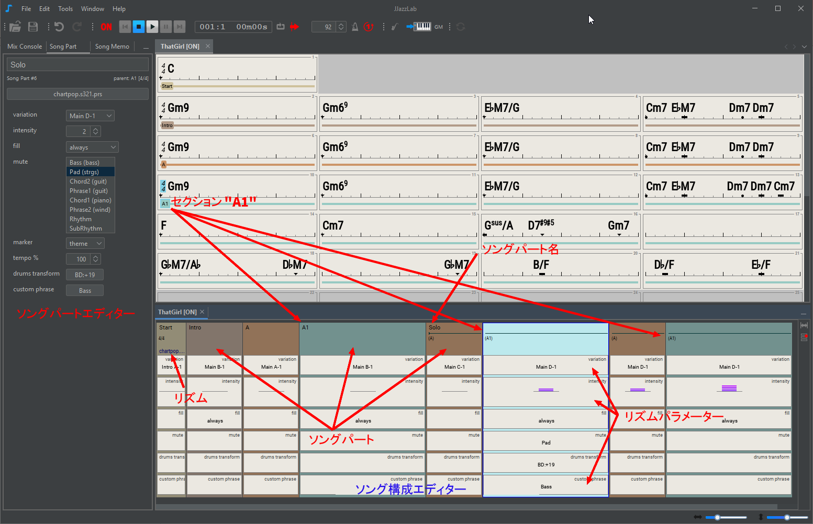

# Song structure

Use the **song structure editor** to:

* Define the order of sections, eg "AABA", "verse verse chorus verse", ...
* Select the **rhythm**(s) to be used&#x20;
* Adjust the **rhythm parameters** to introduce dynamics, eg variation, intensity, fill, muted instrument, ...

## Song parts

A **song part** is linked to a parent **section** of the [chord lead sheet](chord-lead-sheet.md).

A song part has a name, a **rhythm** and a value for each of the **rhythm parameters**.

To add a new song part:

* drag a section from the chord lead sheet into the song structure editor, or
* right-click menu **Insert**, or&#x20;
* copy an existing song part: drag it while pressing the ctrl key, use copy & paste, or right-click menu **Duplicate**

By default the name of the song part is the name of the parent section. If the song part is renamed, the parent section is shown below the name.

If some contiguous song parts share the same name, then the name is displayed only on the first song part and a line is shown on the contiguous song parts. Clicking this line will select all the related song parts.

## Editing

Song parts can be reordered by dragging them using the mouse.

You can modify the song part **name**, **rhythm**, and **rhythm parameter** values.

Edition is done directly from the song structure editor using the [mouse](song-structure.md#mouse-shortcuts), or from the **song part editor** (see the image at the top of this page). Edits apply on the selected song parts or rhythm parameters.

Use the popup menu (**right-click** on windows/Linux, **ctrl-click** on Mac) to see commands available for the current selection, as shown in the 2 images below.

When selecting several contiguous rhythm parameters, you can use the **Adjust values** submenu in the rhythm parameter popup menu to interpolate values between the first and the last selected values.  In the example below, we used it to gradually increase the tempo from 100% to 108%.

## Change rhythm

Each song part can have its own rhythm.&#x20;


Midi can only accommodate 16 channels, and many rhythms use 7 or 8 instruments. That's why it's difficult in practical to have a song with more than 2 rhythms.


To change the rhythm, select a song part and press **R,** or click the rhythm name to open the **rhythm selection dialog**.

When changing the rhythm, JJazzLab tries to adapt the values of the previous rhythm parameters to the new rhythm parameters.

If you want to remove a rhythm change in the middle of a song, select the song part and use **Remove Rhythm Change** from the song part popup menu.

## Rhythm parameters

### Types

In theory a rhythm (or style) can define its own set of parameters. However in JJazzLab most rhythms use the same parameters:

* **Variation**: a rhythm variation. [YamJJazz engine](../../rhythm-engines/yamjjazz-rhythm-engine/) rhythms usually have 4 _Main_ variations, plus some _Intros_, _Endings_, and some _Fills_.
* **Intensity:**  most rhythm engines use this parameter to increase/decrease the Midi velocity of the backing track notes
* **Drums fill**: JJazzLab will add a drums fill on the last bar of the song part.
* **Mute**: mute one of more instruments during this song part. To edit this parameter it's easier to use the **song part editor** (see snapshot at the top of this page)**.**
* **Marker**: this parameter is useful only if you use substitute chord symbols in the chord leadsheet, as explained [here](chord-lead-sheet.md#substitute-chord-symbol).
* **Tempo factor**: slow down or accelerate the tempo of the song part.
* **Drums transform**: change some drums notes of the song part. For example you can make the hi-hat louder, or change the closed hi-hat notes into ride cymbal notes.

*   **Custom phrase**: replace one or more instrument phrases of the song part.&#x20;

    To import your custom phrase, you can drag & drop a Midi file in the Custom phrase editor shown below, or use your external Midi editor via the **Customize** button.

    When using **Edit via external Midi editor** JJazzLab will first export the full backing track as a temporary Midi file, and then open it with your external Midi editor, so that you can change notes of one or more tracks.

### Edit values

You can adjust the value of the parameters of each song part.&#x20;

For the enumerable parameters, the easiest way to edit the value is to select it and use the mouse-wheel.&#x20;

But you can also use rhythm parameter popup-menu to reset the parameter value, or copy/paste values, or use the **song part editor** (see snapshot at the top of this page).

### Compact / full view

By default only a subset of the rhythm parameters are shown, this is the **compact view**. Click on the button below to switch between compact and full view.

The **compact view settings** button, just above the compact view, lets you choose which rhythm parameters are visible in the compact view. These settings are saved with the song.

## Mouse shortcuts

| Selection                        | Mouse             | Action                                  |
| -------------------------------- | ----------------- | --------------------------------------- |
| song part, rhythm param.         | click             | select                                  |
| song part                        | double click      | edit song part name                     |
| song part name                   | click             | edit                                    |
| rhythm                           | click             | select a rhythm                         |
| editor, song part, rhythm param. | right-click       | open popup menu                         |
| rhythm parameter                 | double-click      | edit value                              |
| rhythm parameter                 | mouse wheel       | change value                            |
| rhythm parameters                | shift+mouse wheel | make values identical then change value |
| editor                           | ctrl mouse wheel  | change X zoom factor                    |

## Keyboard shortcuts


Many actions are also available via the context menu (right-click on Windows/Linux, ctrl-click on Mac), and when available the associated shortcut is displayed.


| Selection                | Key          | Action                 |
| ------------------------ | ------------ | ---------------------- |
| song part, rhythm param. | enter        | edit song part name    |
| song part, rhythm param. | R            | select rhythm          |
| song part, rhythm param. | I            | insert song part       |
| song part, rhythm param. | ctrl-I       | append song part       |
| song part, rhythm param. | D            | duplicate song part(s) |
| song part                | delete       | delete song part(s)    |
| rhythm parameter         | ctrl-up/down | next/previous value    |
| rhythm parameter         | Z            | reset param. value     |
| song part                | ctrl-C/X/V   | copy/cut/paste         |
| editor                   | ctrl-Z/Y     | undo/redo              |
| editor                   | ctrl-F       | zoom to fit width      |
| editor                   | V            | compact or full view   |
