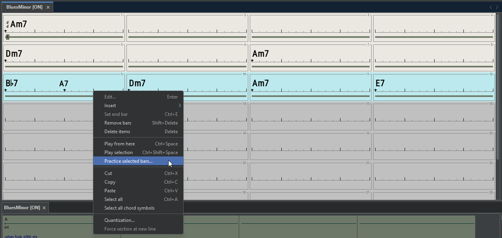
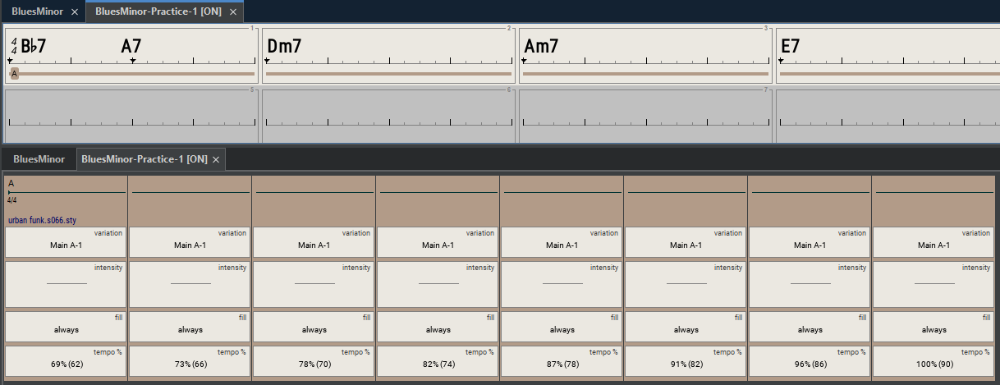

# Practice loop with tempo increase

This tool lets you loop selected measures with gradually increasing tempo. Perfect for practicing difficult passages - start slow and build up speed progressively with each repetition.

Select the bars to be looped, then choose **Practice selected bars...** in the bar popup menu:

<figure><figcaption></figcaption></figure>

Then you need to setup the loop parameters:

<figure><figcaption></figcaption></figure>

Adjust the start/final tempo and the number of loops, then click on **Create Song.**&#x20;

You're ready to play the song and start practicing! You can save this practice song if you want to reuse it.

<figure><figcaption></figcaption></figure>
