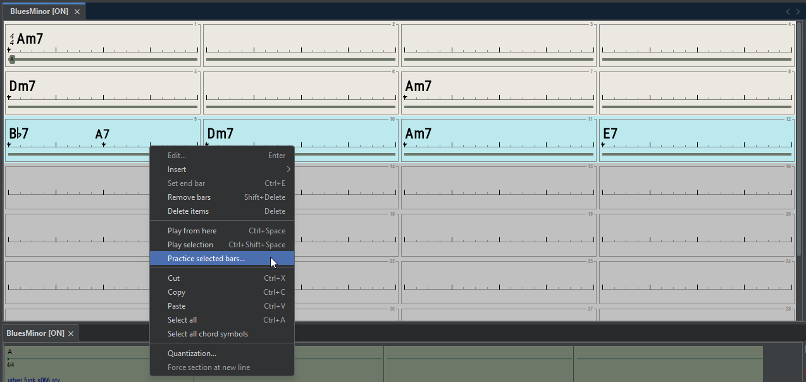
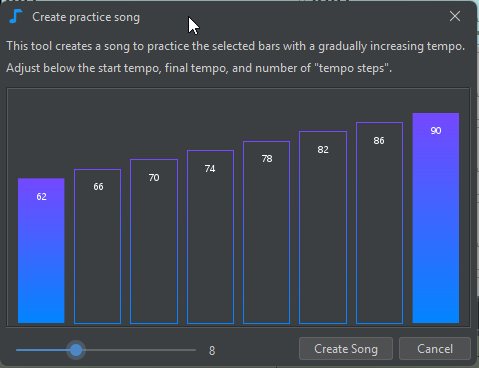
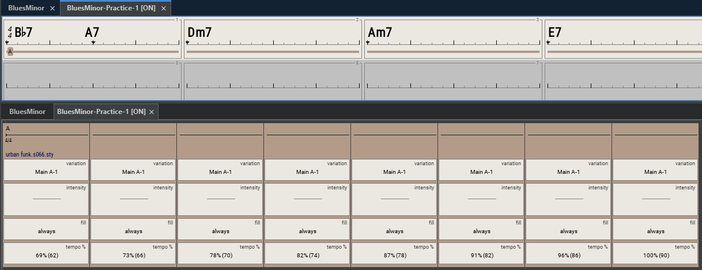

# テンポを上げていく繰り返し練習

このツールは選択した小節を徐々にテンポを上げながら繰り返し再生します。難しいパッセージの練習に最適です。最初はゆっくり始め、繰り返すたびに徐々にスピードを上げていきます。

繰り返す小節を選択し、小節ポップアップメニューから **Practice selected bars...** を選択してください：

<figure><figcaption></figcaption></figure>

次にループパラメータを設定する必要があります：

<figure><figcaption></figcaption></figure>

開始/最終テンポと繰り返し回数を調整し、**Create Song.**をクリックしてください。&#x20;

曲を再生して練習を始める準備が整いました！この練習用曲を保存しておけば、後で再利用できます。

<figure><figcaption></figcaption></figure>
