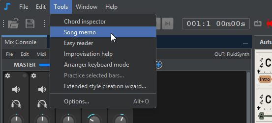
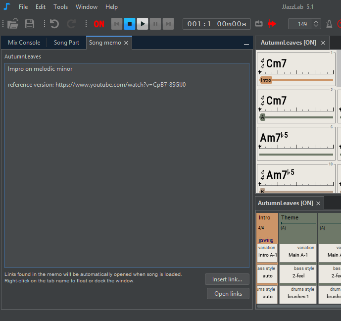

# Song memo

<figure><figcaption></figcaption></figure>

<figure><figcaption></figcaption></figure>

The links are automatically opened when you open the song file.


For security reasons, you can insert up to 4 links only with the following extensions:&#x20;

* "pdf", "txt", "md", "rtf"
* &#x20;"jpg", "jpeg", "png", "gif", "webp", "svg", "bmp"
* "mp3", "wav", "flac", "ogg", "m4a", "aac", "wma", "mp4", "mov", "avi", "mkv", "webm"
* "mid", "midi"
* "mscz", "mscx", "xml", "musicxml", "gp", "gpx", "gp5", "ly", "sib"
* "doc", "docx", "xls", "xlsx", "odt", "ods"


