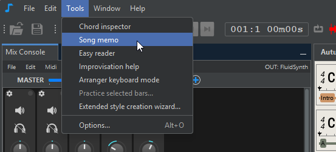
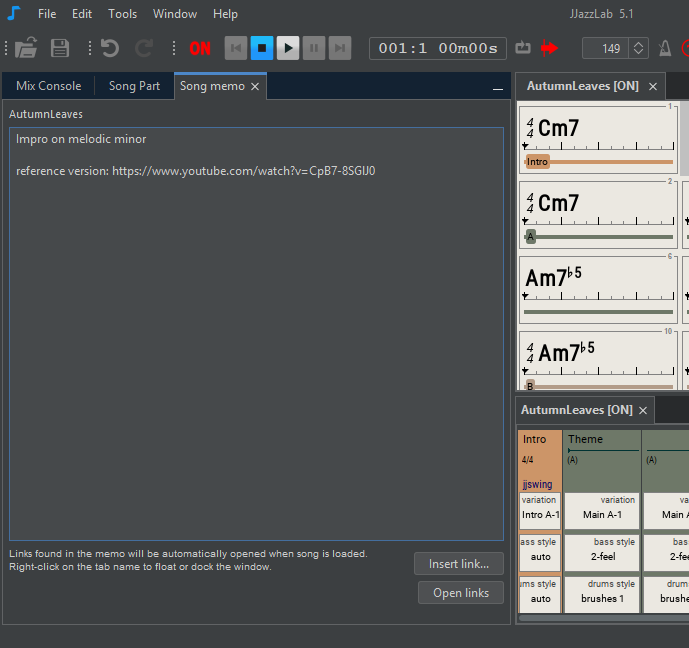

---
ソングメモでは、曲に関するテキストのリマインダーを書き込めます。
ローカルファイルやウェブサイトのリンクを含めて、すぐに参照できるようにできます。
---

# ソングメモ

<figure><figcaption></figcaption></figure>

<figure><figcaption></figcaption></figure>

**Insert link...**ボタンを使用して、コンピュータファイルまたはウェブページへのリンクを挿入します。

**Open links**ボタンは、メモ内のすべてのリンクを開きます。リンクは、ソングファイルを開いたときに自動的に開かれます。


セキュリティ上の理由により、以下の拡張子を持つリンクのみ最大4つまで挿入できます：&#x20;

* "pdf", "txt", "md", "rtf"
* &#x20;"jpg", "jpeg", "png", "gif", "webp", "svg", "bmp"
* "mp3", "wav", "flac", "ogg", "m4a", "aac", "wma", "mp4", "mov", "avi", "mkv", "webm"
* "mid", "midi"
* "mscz", "mscx", "xml", "musicxml", "gp", "gpx", "gp5", "ly", "sib"
* "doc", "docx", "xls", "xlsx", "odt", "ods"


