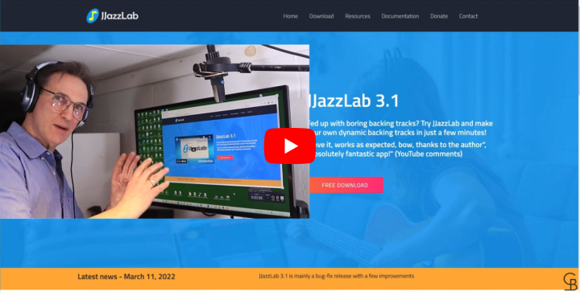

# Video tutorials

## Installation (Windows only)

Step-by-step instructions, thanks to John from GuitarBasement.

## For starters



&#x20;

## 15 min. tutorial



## 10 keyboard shortcuts you need to know



## 4 quick tips



## JJazzLab, Reaper and VST plugins

This video is done with Reaper, but the approach remains the same with any DAW.

Thanks to MINDoSOFT for this video.



## How to make you own Yamaha-extended styles (advanced)



## Output Synth configuration example

This video shows how to optimize the Output Synth configuration for the Yamaha MX synth, but the approach is valid for other synths as well.

When Output Synth configuration is correct, JJazzLab is easier to use (you can select your sounds directly from the Mix Console) and many Yamaha styles will sound better because:

* JJazzLab can automatically pick the "best" sounds for each rhythm
* JJazzLab can manage the XG specific drums sounds used by many Yamaha styles (e.g. brush or percussion sounds)

Thanks to MINDoSOFT for this video.


